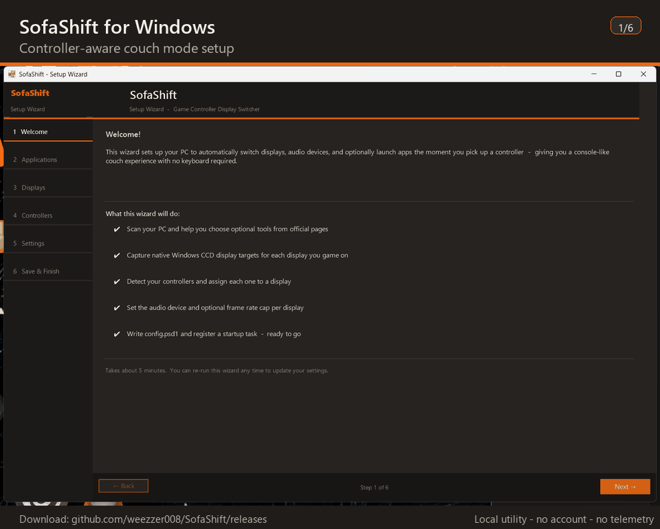

<p align="center">
  
</p>

<h1 align="center">SofaShift for Windows</h1>

<p align="center">
  
</p>

<p align="center">
  Controller-aware PC couch gaming setup for Windows.
</p>

SofaShift watches for mapped controller connections and helps your Windows gaming PC shift into couch mode: display profile, audio route, optional frame-rate cap, and couch-gaming apps.

<p align="center">
  
</p>

## Why

If your desk setup and TV setup are never quite the same setup, SofaShift is for the annoying middle step. Grab a mapped controller and SofaShift can move the PC toward your couch profile without a round trip through Windows settings.

## What It Can Do

- Switch to a saved display profile for your TV or couch setup.
- Route audio with NirCmd when configured.
- Apply an optional frame-rate cap with FRL Toggle.
- Launch Playnite, Hue Sync, and custom couch-gaming apps.
- Restore your desktop profile when the mapped controller disconnects.

## Download

Download the latest installer from [GitHub Releases](https://github.com/weezzer008/SofaShift/releases).

Use only the `SofaShift-Setup.exe` release asset. GitHub may also show automatic `Source code (zip)` and `Source code (tar.gz)` downloads; those are not the SofaShift installer.

SofaShift is a local Windows utility. It does not require an account and does not intentionally send telemetry or logs over the network.

## Source Code

This repository includes the PowerShell source used to build the release installer:

- `setup_wizard.ps1` - WinForms setup wizard and generated runtime file writer.
- `controller_watch.ps1` - background controller monitor used after setup.
- `build_wizard_exe.ps1` - build script that bundles the watcher into the wizard and compiles `SofaShift-Setup.exe` with ps2exe.
- `SofaShift.ico` - application icon used by the compiled setup EXE.

The release EXE is provided for convenience, but you can inspect the scripts directly before running it.

## Build From Source

Requirements:

- Windows 10 or Windows 11.
- Windows PowerShell 5.1 or PowerShell 7.
- ps2exe from PowerShell Gallery.

Build:

```powershell
Install-Module -Name ps2exe -Scope CurrentUser -Force
.\build_wizard_exe.ps1
```

The build script creates `SofaShift-Setup.exe` in the repository folder. It embeds the current `controller_watch.ps1` into a temporary copy of `setup_wizard.ps1` before compiling, so the released installer and watcher stay in sync.

## Requirements

- Windows 10 or Windows 11.
- PowerShell for the background monitor. Windows PowerShell 5.1 is normally built into Windows 10/11, and PowerShell 7 is also supported.
- Optional tools: NirCmd for audio switching, Playnite, Hue Sync, MonitorSwitcher, and FRL Toggle.

## Install

1. Download `SofaShift-Setup.exe` from the latest release.
2. Put it in the folder where you want SofaShift to live.
3. Run the EXE and follow the setup wizard.

The setup EXE writes the monitor script, config, launcher, logs, and uninstall helper beside itself. Keep those generated files together with the EXE.

The current EXE requests administrator rights so it can create the scheduled task with the run level needed for optional FRL Toggle behavior. SofaShift installs per-user files and an HKCU uninstall entry; it does not install a system service.

## Notes

- Windows SmartScreen may warn because this first release is unsigned. Use only the EXE attached to this repository's GitHub release.
- Logs may include local paths, display identifiers, audio device names, and controller IDs. Redact logs before sharing them publicly.
- SofaShift does not silently download, extract, or run third-party tools. It opens official pages and lets you select local executables.

## Uninstall

Use Windows Settings or run `uninstall_sofashift.cmd` from the SofaShift install folder.

The uninstaller removes known SofaShift-created files, the `SofaShift Monitor` scheduled task, and the SofaShift per-user uninstall entry. It leaves `SofaShift-Setup.exe` and unrelated files in the folder.

## Tip Jar

SofaShift is free for personal use. If it saves you some couch-to-desk shuffling, tips are welcome:

[paypal.me/weezzer008](https://paypal.me/weezzer008)
